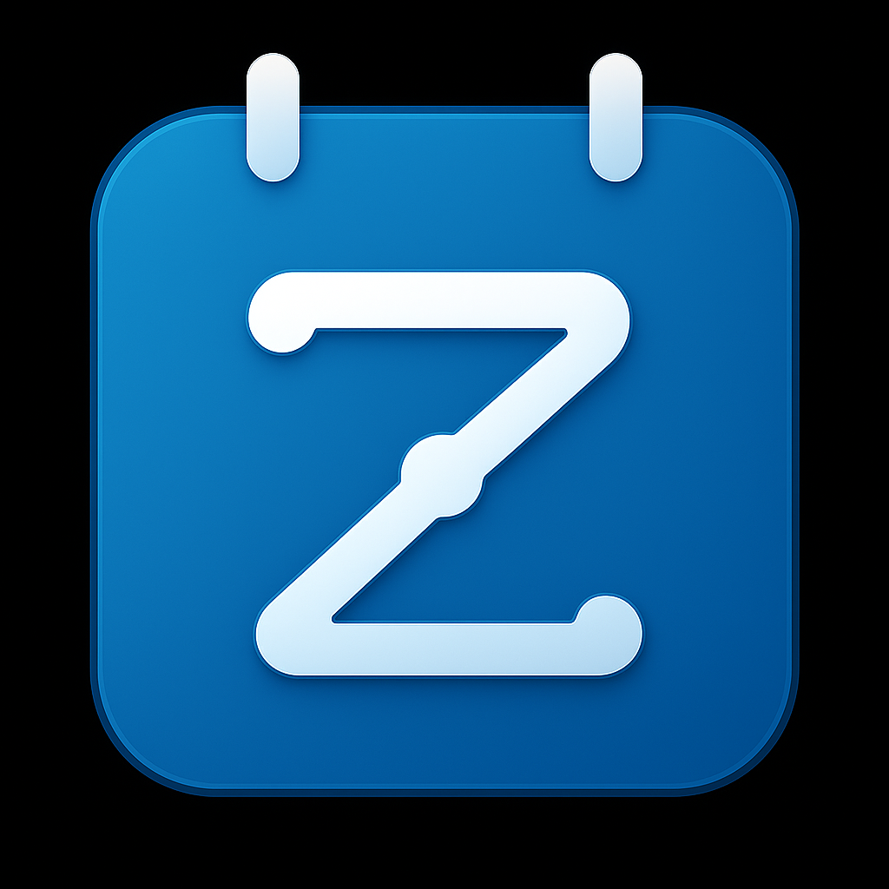

# ⏳ Zeno – Your Serverless Time Management Assistant

**Zeno** is a lightweight, chat-based time management assistant designed to be **fully automated, zero-maintenance, and serverless** by default.

---

## 🚀 Overview

Zeno is built using a modern serverless stack to ensure automatic deployments, zero config overhead, and effortless scalability.

🔧 **Tech Stack**  
- 🧱 **Frontend:** [Vercel (Next.js)](https://zeno-frontend-ten.vercel.app/)  
- ⚡ **Backend:** [Cloudflare Workers](https://zeno-backend.harshsaw01.workers.dev/)  
- 🗃️ **Database:** [Neon PostgreSQL](https://neon.tech)  
- 🔐 **Auth:** Manual Google OAuth *(coming in Phase 1)*  
- 🚀 **CI/CD:** Push-to-deploy via GitHub

---

## 📁 Project Structure

```

zeno/
├── frontend/      \# Next.js frontend (Vercel)
├── backend/       \# Cloudflare Worker API \& logic
├── infra/         \# DB migrations \& deployment config
└── README.md      \# You're here!

```

---

## ✅ Phase 0 – Completed Tasks

| ✅ Task | Description |
|--------|-------------|
| ✅ Repo initialized | Base structure set up |
| ✅ Frontend deployed | Live on Vercel |
| ✅ Backend deployed  | Hosted on Cloudflare |
| ✅ Secrets secured   | Managed in dashboards |
| ✅ Neon DB connected | PostgreSQL instance live |
| ✅ Schema initialized | Tables: `users`, `sessions` |

### 🌐 Live Links

| Service     | URL |
|-------------|-----|
| 🖥️ Frontend | [zeno-frontend-ten.vercel.app](https://zeno-frontend-ten.vercel.app/) |
| 🔌 Backend  | [zeno-backend.harshsaw01.workers.dev](https://zeno-backend.harshsaw01.workers.dev/) |

---

## 🌱 What's Next – Phase 1 (MVP)

🎯 Key goals for the next milestone:

1. 🔐 Implement **Google OAuth authentication**
2. 📥 Store **OAuth tokens** in the Neon DB
3. 📅 Fetch and display **Google Calendar events** in the frontend

---

## ⚙️ Deployment Pipeline

📦 **Deployment Triggers**

| Component | Hosting     | Trigger       |
|-----------|-------------|----------------|
| Frontend  | Vercel      | 🔁 Push to `main` |
| Backend   | Cloudflare  | 🔁 Push to `main` |
| Database  | Neon        | ⚙️ Managed (serverless) |

🔑 **Secrets Management**

| Platform         | Location |
|------------------|----------|
| Cloudflare       | `Workers → Settings → Variables` |
| Vercel           | `Project → Settings → Environment Variables` |

---

## 📌 Summary

Phase 0 is ✅ **complete** – Zeno now runs on a **serverless**, **auto-deploy**, and **zero-maintenance** architecture.

Phase 1 will enable real interaction with the user's calendar and authentication layer — setting the stage for MVP.

---